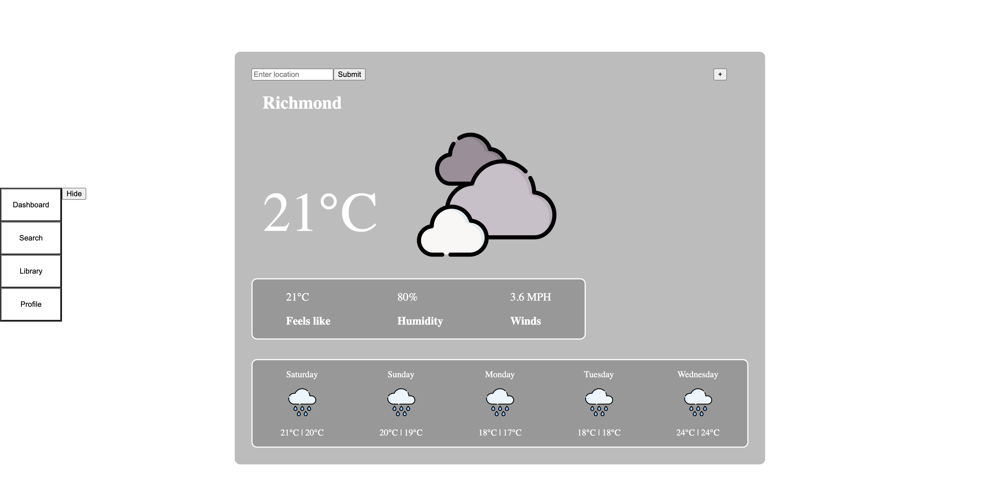
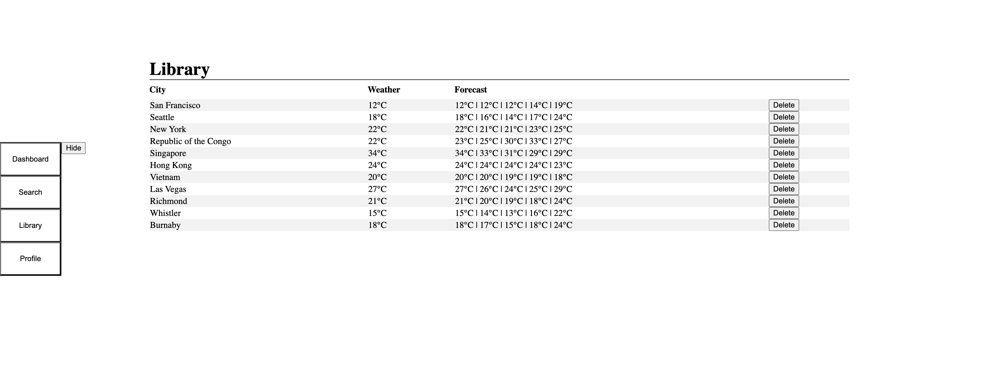

# MERN Weather App
> A weather app allows you to find out the current weather and forecast whereever you are and in other locations. Find detailed information on current weather and “Feels like” temperature, wind speed and humidity and forecast for the next 5 days. 


## Table of Contents
* [General Info](#general-information)
* [Technologies Used](#technologies-used)
* [Features](#features)
* [Screenshots](#screenshots)
* [Setup](#setup)
* [Project Status](#project-status)
* [Room for Improvement](#room-for-improvement)
* [Contact](#contact)


## Technologies Used
- MongoDB
- Express
- React
- Node
- Axios - Post, Get, Delete
- Third Party API: Openweathermap - current weather API, forecast API, geocoding API


## Features
List the ready features here:
- Find detailed information of current weather and forecast of your location
- Search and check weather and forecast in other locations
- Save your precious locations into your library for future reference
- Delete locations no-longer needed locations


## Screenshots




## Setup
To run this project, install it locally using:
```
npm install
```
To run/start project, do the following:
```
Server: 
  cd server
  node server or nodemon server

 Client: 
  cd client
  npm start
```

## Project Status
Project is: _in progress_ 


## Room for Improvement

Room for improvement:
- CSS: UI improvements

To do:
- Loading indiciator
- Authentication
- Redux
- Filter library
- Sort library
- Display previously searched locations

## Contact
Created by [Barry Pun](bpun1p@gmail.com) - feel free to contact me!
